</picture>

<picture>
  <source media="(prefers-color-scheme: dark)" srcset="assets/h-stack-dark.svg">
  <source media="(prefers-color-scheme: light)" srcset="assets/h-stack-light.svg">
  
</picture>

<picture>
  <source media="(prefers-color-scheme: dark)" srcset="assets/h-build-dark.svg">
  <source media="(prefers-color-scheme: light)" srcset="assets/h-build-light.svg">
  
</picture>

<picture>
  <source media="(prefers-color-scheme: dark)" srcset="assets/h-flow-dark.svg">
  <source media="(prefers-color-scheme: light)" srcset="assets/h-flow-light.svg">
  
</picture>

<picture>
  <source media="(prefers-color-scheme: dark)" srcset="assets/h-stats-dark.svg">
  <source media="(prefers-color-scheme: light)" srcset="assets/h-stats-light.svg">
  
</picture>

<picture>
  <source media="(prefers-color-scheme: dark)" srcset="assets/h-touch-dark.svg">
  <source media="(prefers-color-scheme: light)" srcset="assets/h-touch-light.svg">
  
</picture>

&nbsp;&nbsp;

